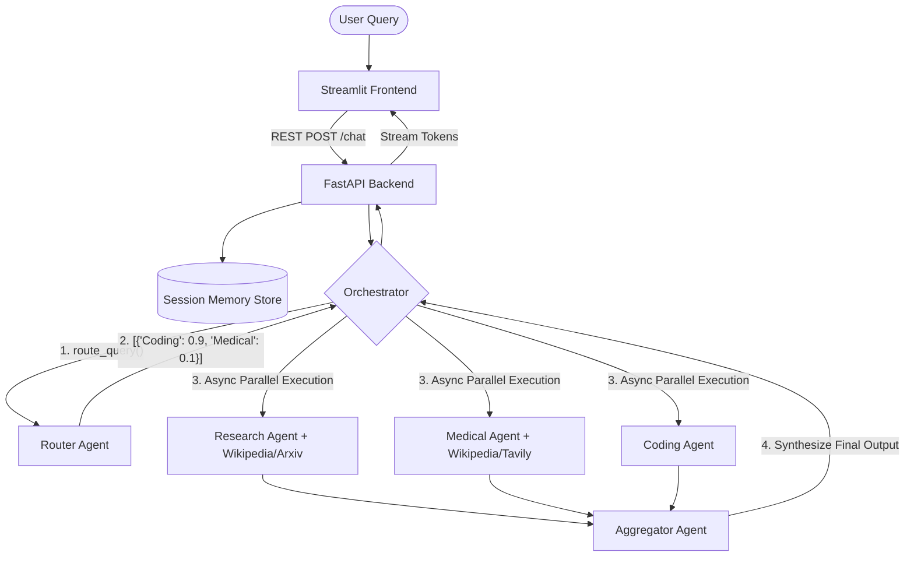

# 🤖 Multi AI Agent System (Confidence Scoring & Orchestration)

A scalable, decoupled Multi-Agent LLMOps project featuring a custom orchestration engine. This project leverages the **Supervisor/Router pattern** coupled with a **Map-Reduce (Scatter-Gather)** execution approach to dynamically parse user queries, determine the most capable expert AI agents, securely run and validate their output in parallel, and aggregate the results into a finalized synthesized response.

## ✨ Key Features
- **Intelligent Routing:** A specialized Router Agent assigns confidence scores (0-1) to determine which expert agent(s) (Research, Medical, or Coding) are best equipped to handle a query.
- **Asynchronous Execution:** Selected agents run entirely in parallel (`asyncio.gather`), drastically reducing latency and overcoming traditional sequential multi-agent bottlenecks.
- **Automated Aggregation:** An Aggregation Agent compiles the separate outputs from multiple experts into a single, cohesive answer format.
- **Interactive UI & Memory:** Streamlit provides a dynamic, streaming chat interface with unique session-assigned continuous memory. 
- **Decoupled API Backend:** FastAPI creates a scalable `/chat` REST endpoint, separating core LLM computation from the Frontend completely.

## 🏗️ Architecture Design

The system relies on a strictly decoupled architecture, optimizing concurrency and abstraction.



### 1. Frontend (`app/frontend/ui.py`)
- Built using **Streamlit**.
- Tracks conversations dynamically using uniquely generated `session_id`'s.
- Uses `iter_content` to read stream chunks from the backend and provide a typewriter-like feel for AI responses.

### 2. Backend (`app/backend/api.py`)
- Asynchronous **FastAPI** application.
- Exposes a centralized JSON pipeline for receiving requests, attaching the correct model context (Google Gemini vs Groq LLaMa), updating session memory, and passing queries to the orchestrator.

### 3. Core Engine (`app/core/orchestrator.py`)
The cornerstone of this project. Steps include:
1. **Routing:** Passes the user's query into the Router LLM. The Router performs zero-shot reasoning to determine the applicable experts and outputs a JSON with agents + confidence scores.
2. **Filtering:** Applies a `CONFIDENCE_THRESHOLD` (0.3). Any agent scoring lower is discarded. 
3. **Execution:** Groups the filtered agents and fires them asynchronously in parallel using Python's `asyncio.gather`. 
4. **Aggregation:** Ingests the independent responses from chosen experts. Instructs the Aggregator LLM to consolidate overlapping information and output an articulate response.

## 🚀 How to Run Locally

### Prerequisites
- Python 3.10+
- Valid API keys for Google Gemini GenAI, Groq, and Tavily.

### 1. Setup Environment
Configure your `.env` file in the root directory:
```bash
GROQ_API_KEY=your_key_here
GOOGLE_API_KEY=your_key_here
TAVILY_API_KEY=your_key_here
```

### 2. Install Dependencies
```bash
pip install -r requirements.txt
```

### 3. Run the Application Services
Run the system via the Python module entry point (this launches both the FastAPI backend on port 9999 and the Streamlit frontend concurrently). 

```bash
python -m app.main
```

## 🛠️ Built With
- **LangChain & LangGraph:** Core LLM wrappers, routing configuration, and agent tool execution.
- **FastAPI:** High performance asynchronous backend.
- **Streamlit:** Rapid UI prototyping.
- **Uvicorn:** ASGI Web Server.